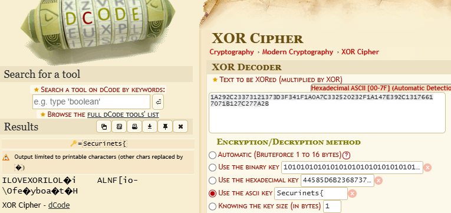
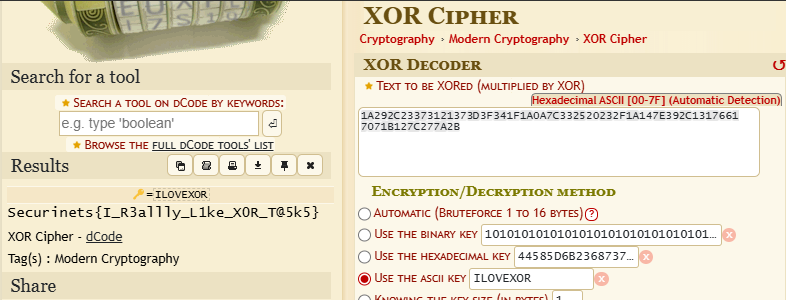

# Task: 0x1 Magic

## Description
> This string feels like it has been altered systematically, leaving behind a traceable transformation.  
> Can you decode it and find the original message?

- **Cipher**: `1A292C23373121373D3F341F1A0A7C332520232F1A147E392C13176617071B127C277A2B`
- **Flag format**: `Securinets{}`
- **Author**: ADX2K

---

## Solution

### Step 1: Understand the Problem
The ciphertext appears to be encoded using an **XOR cipher**, which applies an XOR operation between the plaintext and a key. The key is reused cyclically to encrypt the data.

### Step 2: Analyze the Cipher
We are given the ciphertext:
```
1A292C23373121373D3F341F1A0A7C332520232F1A147E392C13176617071B127C277A2B
```
We also know the **flag format** begins with `Securinets{`. This provides a known plaintext, which we can use to help recover the key.

### Step 3: Use XOR Decryption Tool
We utilize the **XOR Cipher Tool** available at [XOR Decryption](https://www.dcode.fr/xor-cipher).

1. Input the given **ciphertext**.
2. Set the **known plaintext** to `Securinets{`.
3. The tool identifies the **XOR key** based on the provided plaintext.

<div align="center">
  
</div><br>

Here we go, we found the key.

Key: ``ILOVEXOR``

### Step 4: Decrypt the Message
Once the **key** is determined, we use the tool to decrypt the full ciphertext by repeating the key cyclically.
<div align="center">
  
</div>

### Step 5: Extract the Flag
After decryption, you get the Flag:

Flag : ``Securinets{I_R3allly_L1ke_X0R_T@5k5}``
