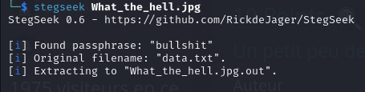

# Task: Concealed Truth

## Description
> Something feels off about this file, as if it’s holding back a secret.  
> Can you bring its hidden contents to light ?

> Author : ADX2K

<br>

<div align="center">
  
</div><br><br>

---

## Solution

### Step 1: Analyze the File
The provided file is an image that looks normal at first glance. However, based on the challenge description, it likely contains hidden data embedded using steganography.

### Step 2: Extract data
Steghide is a common tool used for embedding data into files. To extract hidden content, we use StegSeek, a tool designed to brute-force passwords for Steghide-embedded files.

Run the following command:<br><br>
<div align="center">
  
</div><br><br>


Great! we got data.txt file : <br>
```VTJWamRYSnBibVYwYzN0VGRETm5hREZrWlY5WVgwSkFjMlUyTkY5UU1IY3pjaUY5```

Now we just need to decode this data twice with base64 : <br>
```echo "VTJWamRYSnBibVYwYzN0VGRETm5hREZrWlY5WVgwSkFjMlUyTkY5UU1IY3pjaUY5" | base64 -d | base64 -d```

Finally we got the flag : <br>
```Securinets{St3gh1de_X_B@se64_P0w3r!}```
