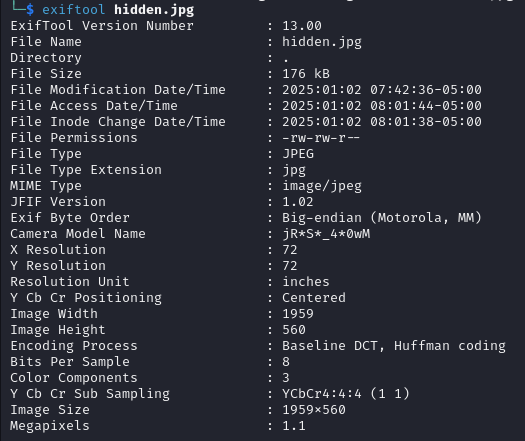

# Task: Hidden Depths

## Description
> This image seems ordinary, but my source insists it holds more than meets the eye.  
> Can you uncover its secrets?

> Author: ADX2K

The challenge provides an image file that appears normal at first glance but contains hidden data. Your mission is to analyze the image, uncover the hidden layers, and retrieve the flag.

<div align="center">
  
</div>


---

## Solution

The solution involves multiple steps using steganographic techniques to uncover the hidden flag.

### Step 1: Examine the Image
Start by inspecting the provided image for any embedded files. Use **binwalk**, a tool for analyzing and extracting data hidden within files.

Run the following command:  
```
binwalk --dd=".*" Gabes.jpg
```

This command extracts any embedded files from the image. After running it, a second image file is discovered in the extracted directory.

<div align="center">
  
</div>

### Step 2: Analyze the Second Image
The second image may contain additional hidden data. Use **ExifTool** to inspect its metadata for clues. Run the following command:  
```
exiftool hidden.jpg
```
<div align="center">
  
</div>

Inspecting the metadata reveals a password hint:  
Password Format: ``jR*S*_4*0wM``

This indicates the password for the next layer follows the format `jR*S*_4*0wM`, where the `*` symbols need to be replaced with characters.


### Step 3: Generate a Wordlist
To proceed, generate a wordlist of possible passwords based on the given format. You can use the following Python script:

```python 
import itertools
base_string = "jR*S*_4*0wM"
wildcard_characters = "abcdefghijklmnopqrstuvwxyzABCDEFGHIJKLMNOPQRSTUVWXYZ0123456789_$*"
wildcard_positions = [i for i, char in enumerate(base_string) if char == '*']
combinations = itertools.product(wildcard_characters, repeat=len(wildcard_positions))
wordlist = []
for combo in combinations:
    chars = list(base_string)
    for pos, replacement in zip(wildcard_positions, combo):
        chars[pos] = replacement
    wordlist.append(''.join(chars))
with open("wordlist.txt", "w") as f:
    f.write("\n".join(wordlist))
print(f"Wordlist generated with {len(wordlist)} combinations and saved to 'wordlist.txt'.")
```

This script generates all possible combinations for the password format and saves them to a file named `wordlist.txt`.

***The password idea gives a clue that Steghide might have been used, as it is one of the few tools that requires a passphrase to extract hidden data. This clue suggests the next step is to try Steghide.***

### Step 4: Use StegSeek to Extract Hidden Data
The next step is to use **StegSeek**, a tool specifically designed for ``brute-forcing Steghide passwords``, to extract the hidden data from the image.

Run the following command:
```
stegseek Gabes.jpg wordlist.txt
```

StegSeek will attempt each password in the wordlist until it successfully extracts the hidden data. After the process completes, the flag is revealed.

