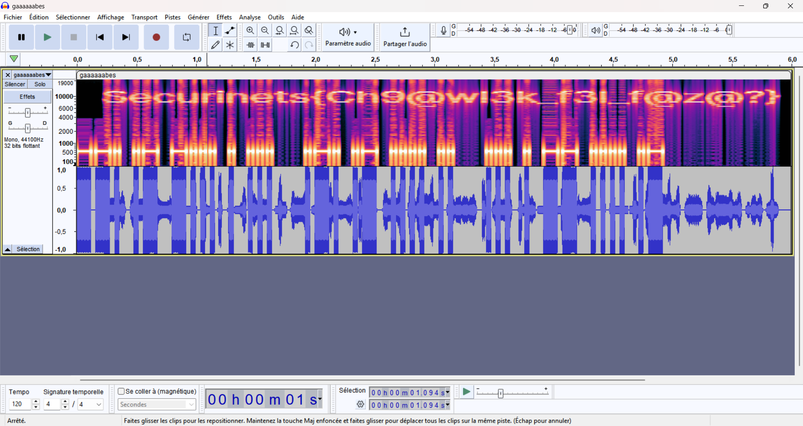

# Task: The Sound of Mystery

## Description
> This audio file reached me under strange circumstances. Its purpose remains unclear.  
> Can you figure out what it hides?

> Author : ADX2K

The challenge provides a `.wav` file that appears normal when played but contains hidden data. Your mission is to uncover the secret.

---

## Solution

### Step 1: Analyze the File
The provided `.wav` file plays without any noticeable abnormalities. However, the challenge suggests there might be hidden information encoded in the audio.


### Step 2: Generate a Spectrogram
A spectrogram visually represents the frequencies in an audio file. To investigate the `.wav` file, we can use tools like **Audacity**. For this walkthrough :

1. Open the `.wav` file in Audacity.
2. Switch to the spectrogram view:
   - Click the arrow next to the track name and select **Spectrogram**.<br>
<div align="center">
  
</div><br>
3. Finally you got the flag : 

```Securinets{Ch9@wl3k_f3l_f@z@?}```


